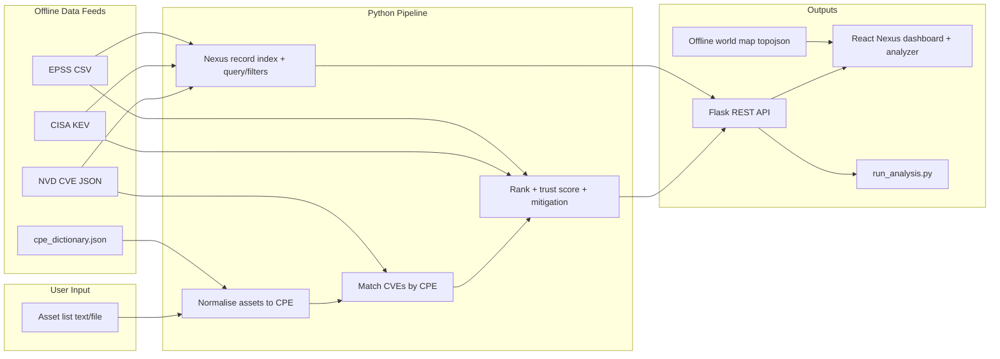

# Vulnify - System Architecture

## High-level flow



## Components

### 1. Normaliser (`pipeline/normalizer.py`)

- Parses lines: `Product | Version`
- Exact then fuzzy match against `cpe_dictionary.json`
- Outputs vendor + product slugs for CPE substring matching

**Hardest problem (per brief):** informal names ≠ CPE. Wrong map = silent miss.

### 2. Matcher (`pipeline/matcher.py`)

- Scans NVD configuration `cpeMatch` entries
- Keeps CVE if `:vendor:product:` appears in any CPE string for a normalised asset

### 3. Ranker (`pipeline/ranker.py`)

```
urgency_score = (1000 if KEV) + epss×100 + cvss×10
```

- Sort descending
- Template-based plain-English `risk_summary`

- Also computes a **trust score** and **status** (confirmed / review / false positive) per finding, plus **mitigation** text and **NVD/MITRE links**.

```
trust = CPE precision (exact/wildcard)
      + normalisation quality (exact/fuzzy score)
      + signal bonuses (CVSS, EPSS, KEV)   → clamped 0-100
```

### 4. Analytics (`pipeline/analytics.py`)

- One pass over full CVE year file (cached after first load)
- Aggregates: severity buckets, monthly timeline, top vendors, vendor-country counts

### 5. Nexus engine (`pipeline/nexus.py`) - the dashboard brain

- **Record index:** one pass builds a flat list of per-CVE records, each tagged with vendor, product, country, city/region, **org sector**, **industry**, severity, CVSS, EPSS, threat type (CWE category), KEV flag, status and month. Built once, cached.
- **`query(filters)`:** filters the index (industry, org type, vendor, country, severity, status, threat type, date range, search) and aggregates everything the dashboard needs - summary KPIs, severity, weakness categories, industry split, by-country, vendors, KEV-by-vendor, EPSS buckets, CVSS histogram, timeline, org sectors, country matrix, locations, top threats and the confirmed feed.
- **`filter_options()`:** distinct industries, countries, vendors, threat types, statuses and the date range for the filter bar.
- **Live stream replay:** replays real NVD publications from the last 21 days; rate = peak hourly publications / 3600. Confirmed CISA KEV records are revealed progressively so the processed / queue / confirmed counters stay internally consistent.
- **Classification:** `industry_taxonomy.json` (Healthcare, Finance, Retail, Government, Telecom, Manufacturing, ...) and `sector_taxonomy.json` (academic, social org, SMB, enterprise); vendor geography from `vendor_locations.json` / `vendor_countries.json`.

### 6. Flask API (`backend/app.py`)

- Stateless; all data in memory
- CORS enabled for Vite dev proxy
- Nexus endpoints accept filter query params and reuse the cached record index

### 7. React frontend

- **Hover-expand sidebar** (`Sidebar.tsx`) switches between dedicated pages (one section per page)
- **FilterBar** (`FilterBar.tsx`) drives global filters; changes refetch `/api/nexus` with query params
- **Nexus** (`Nexus.tsx`) renders one page at a time: Overview, Live feed, Threat analysis, Geographic, Industries, Org sectors, Vendors, Confirmed exploits
- **WorldMap** (`WorldMap.tsx`) offline vector choropleth (react-simple-maps + bundled `public/world-110m.json`) with zoom/pan/hover
- **Analyzer** (`Analyzer.tsx`) findings cards with trust meter, risk summary, mitigation and CVE links
- Visuals: severity **donut** with centered total, **radial risk gauges**, gradient bars

## Tech stack summary

| Layer | Technology |
|-------|------------|
| Language | Python 3.10+, TypeScript |
| API | Flask 3 |
| UI | React 19, Vite, Recharts, react-simple-maps |
| Matching | rapidfuzz |
| Data | pandas, stdlib json/gzip |

## Performance notes

- CVE-2025.json ~214MB, first dashboard load may take 30 to 90 seconds
- Results cached in `AnalyticsEngine._cache`
- Stack analysis filters in one pass; typically faster for matched subset

## Security

- No authentication (local hackathon demo)
- Do not expose to public internet without hardening
- All vulnerability data is public OSINT

## Deployment (demo laptop)

Terminal 1: `cd backend && source .venv/bin/activate && python app.py`  
Terminal 2: `cd frontend && npm run dev`
